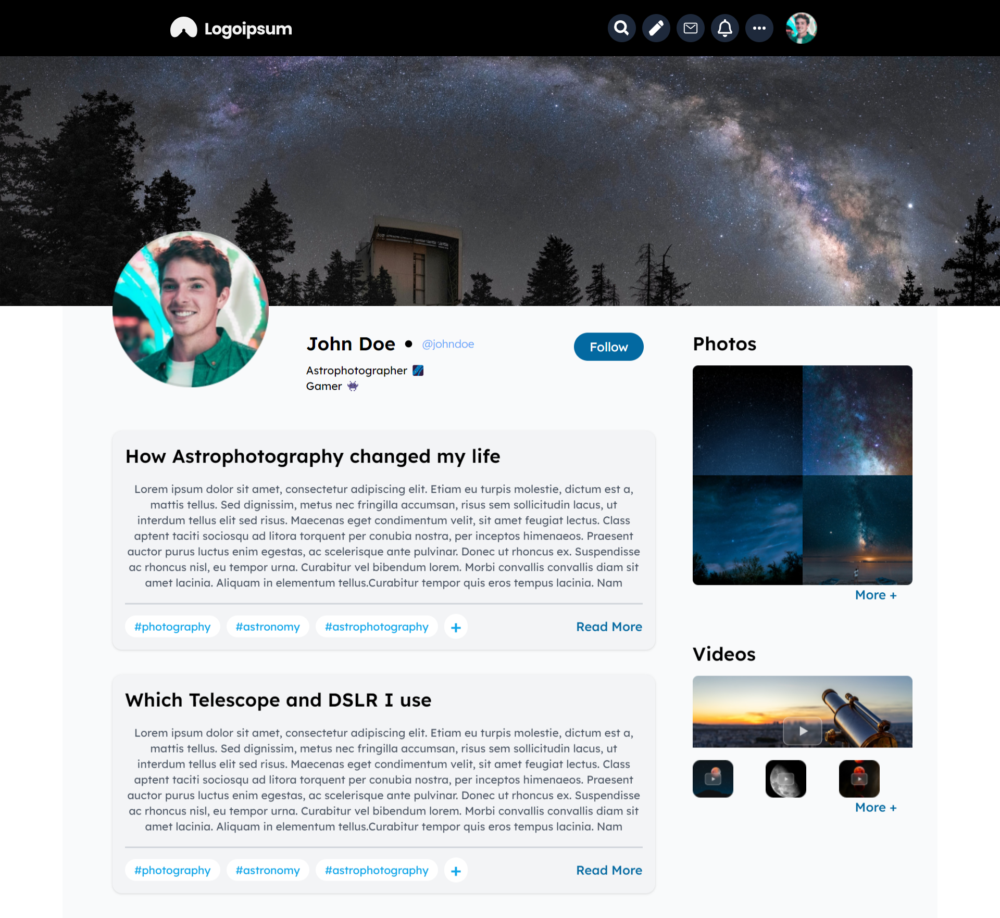
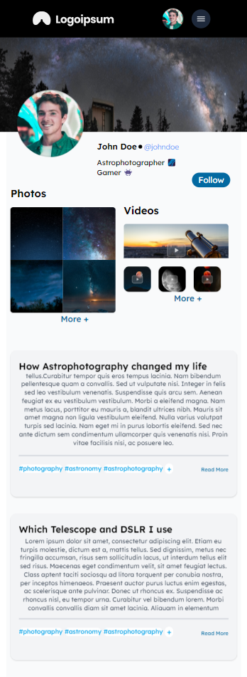

# Task Project

This is the "Task 1: Create a responsive webpage" project, built using React JS, Tailwind CSS. The application features a user profile, photo and video gallery, and a blog section.

## Table of Contents

- [Features](#features)
- [Project Structure](#project-structure)
- [Screenshots](#screenshots)
- [Technologies Used](#technologies-used)

## Features

- **Responsive Navigation Bar:** Includes search, pen, mail, bell, and dots icons with a responsive menu for small devices. Here I have used React icons.
- **Profile Background:** Displays a profile background image.
- **User Profile:** Showcases user information including profile picture, name, username, and bio.
- **Photos and Videos Gallery:** Displays a grid of photos and videos with an option to view more.
- **Blog Section:** Lists blog posts with titles, content previews, and read more links.

## Project Structure

- **`public/`**: Contains public assets like the HTML file.
- **`src/`**: Contains the main codebase for the project.
  - **`assets/`**: Contains images used in the application.
  - **`components/`**: Contains React components such as `NavBar`, `ProfileBg`, `Container`, `User`, `PhotosVideos`, and `Blog`.
  - **`constants/`**: Contains static data such as `Data`.
  - **`App.js`**: Main application component.
  - **`index.js`**: Entry point for the React application.
- **`package.json`**: Contains project metadata and dependencies.

## Screenshots

### For Large Device

### For Small Device

## Technologies Used

- **React JS**: JavaScript library for building user interfaces.
- **Tailwind CSS**: Utility-first CSS framework for styling.
- **React Icons**: Library for including popular icons in React projects.
- **Vite**: Next-generation frontend tooling for development and build.

## Video Demo

Watch the video demo [Here](https://drive.google.com/drive/folders/15Mh_wdM-8nsDwLGIcmwmMX2VD7KWldoq).

